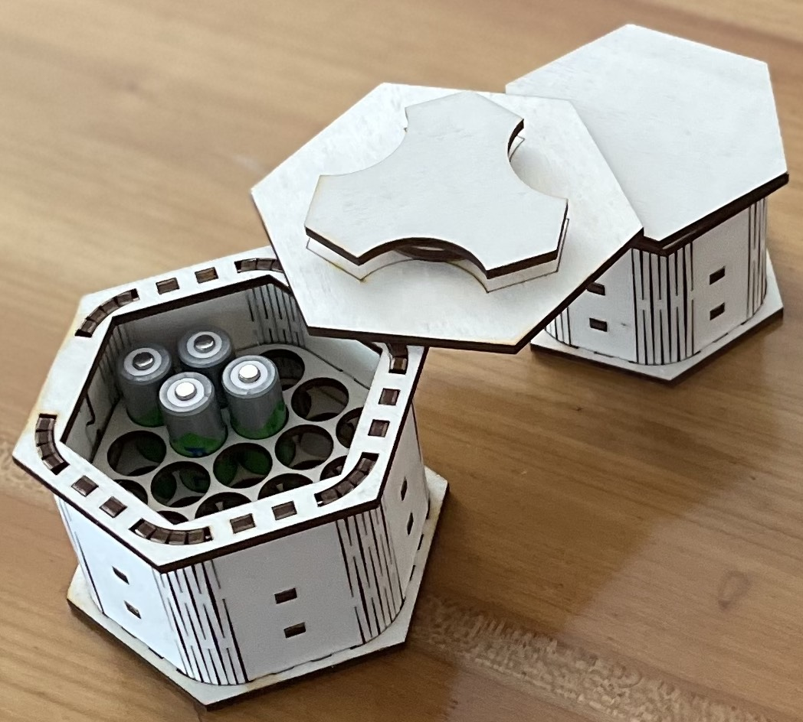
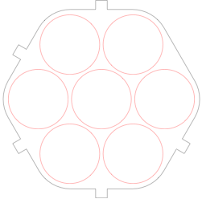
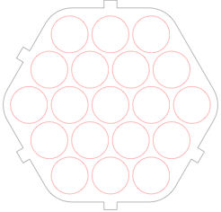

# Battery Case Generator

A python script generating SVG plans for laser cut hexagonal battery cases:

Most geometry is generated by a turtle graphics style SVG generator for python I wrote, so I would not have to work out too much of the math myself.

The lid is held in place by a latch mounted at a 30 deg angle to the corners of the lid, so it inserts when the corners are angled, and locks when the corners are aligned. 

The only glue used is for the latch, everything else is holding together by friction/tension (though I have not yet exercised these cases under heavy load, and obviously they are not particularly rugged, let alone weatherproof).

While the script can take a lot of parameters for tuning, only 3 of them are definitely needed, and a fourth may need adjusting in some cases:

* The **dimension** (always odd) specifies the number of batteries in the diagonal, typically 3 or 5.
 
* The **thickness** specifies the thickness (in millimeters) of the material used. The cases above were made with 4mm poplar plywood.
* The **hole** specifies the diameter for the holes in millimeters, with symbolic values predefined for the common D, C, AA, and AAA battery types.

Depending on the material you're using and the characteristics of your laser, you may need to change the **kerf**, the amount of material removed by a laser cut that the computation has to compensate for.

### Cutting and Assembly Instructions

The resulting SVG is arranged into 3 groups, distinguished by their colors. You might need to manually readjust their order:

1. Blue markings are intended to be **scored** in an initial pass. These are markings on the bottom of the lid to show the orientation in which the latch mechanism is to be mounted.
2. Red markings should be **cut** next. These are interior holes.
3. Finally, black markings should be **cut**. These are the exterior outlines; I prefer to cut them last in case a piece comes loose and shifts after it is cut.

## Examples

Here are two generated plans:

* [Dimension 3 (8 batteries), C cells, 4mm material](svg/3C_4mm.svg)
* [Dimension 5 (21 batteries), AA cells, 3mm material](svg/5AA_3mm.svg)

## Author

Matthias Neeracher <microtherion@gmail.com>

## License

 This work is licensed under a <a rel="license" href="http://creativecommons.org/licenses/by/4.0/">Creative Commons Attribution 4.0 International License</a>.
